# Manual de Usuario - SimpliCode

## Índice

1. Introducción
2. Instalación y Configuración
   - Requisitos del Sistema
   - Proceso de Instalación
3. Interfaz de Usuario
   - Barra de Herramientas
   - Editor de Código
   - Panel de Resultados
4. Primeros Pasos con SimpliCode
   - Crear un Nuevo Archivo
   - Abrir un Archivo Existente
   - Guardar un Archivo
5. El Lenguaje SimpliCode
   - Sintaxis Básica
   - Tipos de Datos
   - Variables y Declaraciones
   - Operadores
   - Estructuras de Control
   - Funciones y Procedimientos
   - Listas y Arreglos
   - Programación Orientada a Objetos
6. Ejecutar y Analizar Código
   - Ejecutando un Programa
   - Visualizando la Consola
   - Revisando Errores
   - Explorando la Tabla de Símbolos
   - Analizando el AST
7. Ejemplos Prácticos
   - Ejemplo Básico: Calculadora
   - Manejo de Listas
   - Uso de Objetos
   - Algoritmo de Ordenamiento
8. Solución de Problemas
   - Problemas Comunes
   - Mensajes de Error
9. Recomendaciones y Buenas Prácticas
10. Referencias

---

## 1. Introducción

SimpliCode es un entorno de desarrollo integrado (IDE) diseñado para facilitar el aprendizaje de conceptos de programación. Ofrece un lenguaje de programación sencillo pero potente, con una sintaxis clara y herramientas visuales para comprender el funcionamiento de un programa.

El IDE incluye:
- Editor de código con soporte para pestañas
- Consola de salida
- Visualización de errores
- Tabla de símbolos
- Visualización gráfica del árbol de sintaxis abstracta (AST)

SimpliCode es ideal para estudiantes de ciencias de la computación, ingeniería de software o cualquier persona interesada en aprender a programar con un enfoque visual y estructurado.

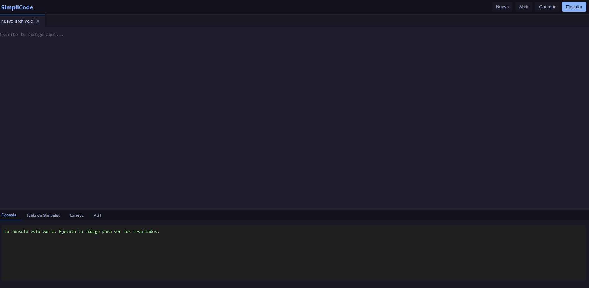

---

## 2. Instalación y Configuración

### 2.1 Requisitos del Sistema

Para ejecutar SimpliCode necesitarás:
- Node.js (versión 14.x o superior)
- NPM (viene incluido con Node.js)
- Navegador web moderno (Chrome, Firefox, Edge)
- 2 GB de RAM mínimo
- 500 MB de espacio en disco

### 2.2 Proceso de Instalación

2. **Instalar dependencias del servidor**:
   ```
   cd server
   npm install
   ```

3. **Instalar dependencias del cliente**:
   ```
   cd ../client
   npm install
   ```

4. **Iniciar el servidor**:
   ```
   cd ../server
   npm start
   ```

5. **Iniciar el cliente** (en otra terminal):
   ```
   cd ../client
   npm start
   ```

6. **Acceder a la aplicación**:
   Abre tu navegador y visita `http://localhost:3000`


---

## 3. Interfaz de Usuario

La interfaz de SimpliCode está diseñada para ser intuitiva y fácil de usar, dividida en tres secciones principales:

### 3.1 Barra de Herramientas

Ubicada en la parte superior de la ventana, contiene los comandos principales:

- **Nuevo**: Crea un nuevo archivo de código.
- **Abrir**: Permite abrir archivos existentes con extensión .ci.
- **Guardar**: Guarda el archivo actual.
- **Ejecutar**: Analiza y ejecuta el código del archivo activo.


### 3.2 Editor de Código

El área central donde escribirás tu código:

- **Pestañas**: Permiten trabajar con múltiples archivos a la vez.
- **Área de edición**: Editor de texto para escribir código SimpliCode.
- **Sistema de pestañas**: Cada pestaña representa un archivo diferente.

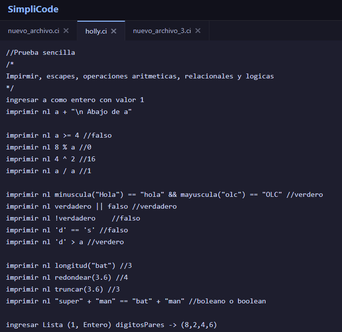

### 3.3 Panel de Resultados

Ubicado en la parte inferior, muestra información sobre la ejecución del programa:

- **Consola**: Muestra la salida de tu programa.
- **Tabla de Símbolos**: Visualiza las variables y sus valores.
- **Errores**: Lista los errores encontrados en el código.
- **AST**: Muestra el árbol de sintaxis abstracta del programa.

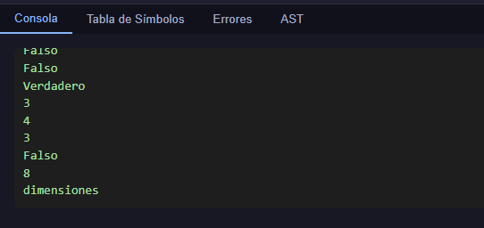
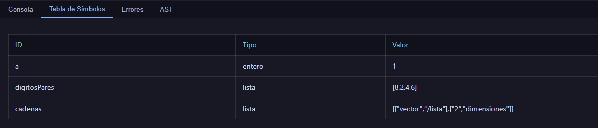
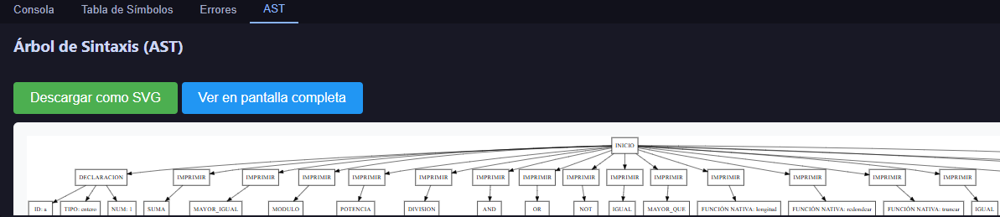
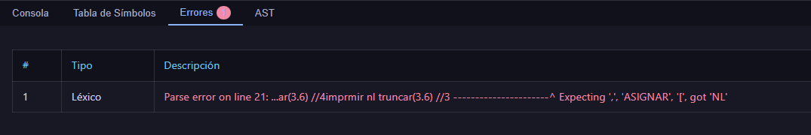

---

## 4. Primeros Pasos con SimpliCode

### 4.1 Crear un Nuevo Archivo

1. Haz clic en el botón "Nuevo" en la barra de herramientas.
2. Se creará una nueva pestaña con un archivo vacío.
3. El nombre predeterminado será "nuevo_archivo_X.ci", donde X es un número secuencial.


### 4.2 Abrir un Archivo Existente

1. Haz clic en el botón "Abrir" en la barra de herramientas.
2. Se abrirá un cuadro de diálogo del sistema de archivos.
3. Navega y selecciona un archivo con extensión .ci.
4. El archivo se cargará en una nueva pestaña.
   
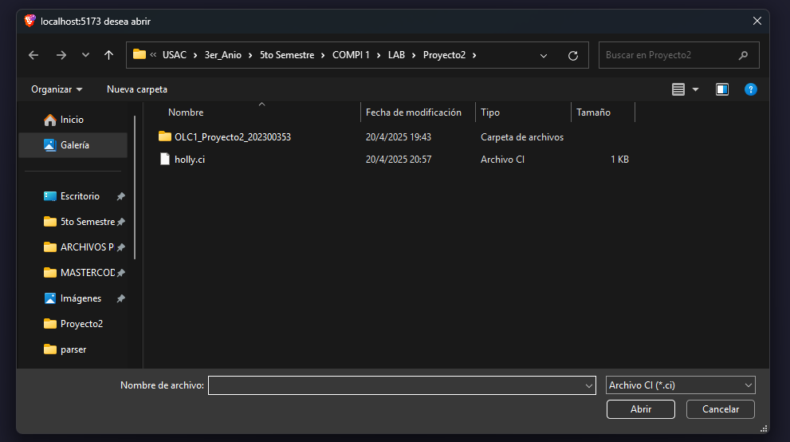

### 4.3 Guardar un Archivo

1. Haz clic en el botón "Guardar" en la barra de herramientas.
2. Si es la primera vez que guardas el archivo, se descargará automáticamente con el nombre que aparece en la pestaña.
3. Los archivos se guardan con la extensión .ci.


---

## 5. El Lenguaje SimpliCode

SimpliCode es un lenguaje de programación diseñado para facilitar el aprendizaje de conceptos fundamentales de programación con una sintaxis clara y expresiva.

### 5.1 Sintaxis Básica

- Las instrucciones pueden separarse por saltos de línea o punto y coma (`;`).
- Los comentarios de una línea comienzan con .
- Los comentarios multilínea se encierran entre `/*` y `*/`.

```
// Este es un comentario de una línea
ingresar x como entero con valor 10

/* Este es un comentario 
   multilínea */
imprimir nl x
```

### 5.2 Tipos de Datos

SimpliCode soporta los siguientes tipos de datos básicos:

- **entero**: Números enteros (ej. 10, -5)
- **decimal**: Números con punto decimal (ej. 3.14, -0.5)
- **booleano**: Valores lógicos (`verdadero` o `falso`)
- **caracter**: Un solo carácter entre comillas simples (ej. 'a', '5')
- **cadena**: Secuencia de caracteres entre comillas dobles (ej. "Hola mundo")

### 5.3 Variables y Declaraciones

Para declarar variables se utiliza la palabra clave `ingresar` seguida del nombre de la variable, la palabra `como` y el tipo de dato:

```
// Declaración sin valor inicial
ingresar edad como entero

// Declaración con valor inicial
ingresar nombre como cadena con valor "Juan"

// Declaración múltiple
ingresar x, y como entero con valor 0
```

La asignación de valores se realiza mediante el operador `->`:

```
edad -> 25
nombre -> "María"
```

### 5.4 Operadores

**Operadores Aritméticos**:
- Suma: `+`
- Resta: `-`
- Multiplicación: `*`
- División: `/`
- Potencia: `^`
- Módulo: `%`

**Operadores Relacionales**:
- Igual que: `==`
- Diferente de: `!=`
- Mayor que: `>`
- Menor que: `<`
- Mayor o igual que: `>=`
- Menor o igual que: `<=`

**Operadores Lógicos**:
- AND: `&&`
- OR: `||`
- NOT: `!`

**Operadores de Incremento/Decremento**:
```
inc(contador)  // Incrementa en 1
dec(contador)  // Decrementa en 1
```

### 5.5 Estructuras de Control

**Condicionales**:

```
// Condicional simple
si x > 5 entonces
    imprimir nl "x es mayor que 5"
fin si

// Condicional con alternativa
si edad >= 18 entonces
    imprimir nl "Es mayor de edad"
de lo contrario
    imprimir nl "Es menor de edad"
fin si

// Condicional múltiple
si nota >= 90 entonces
    imprimir nl "Excelente"
o si nota >= 80 entonces
    imprimir nl "Muy bien"
o si nota >= 70 entonces
    imprimir nl "Bien"
de lo contrario
    imprimir nl "Necesita mejorar"
fin si
```

**Switch (selección múltiple)**:

```
segun opcion hacer
    en caso de ser 1 entonces
        imprimir nl "Opción 1 seleccionada"
    detener
    
    en caso de ser 2 entonces
        imprimir nl "Opción 2 seleccionada"
    detener
    
    de lo contrario entonces
        imprimir nl "Opción no válida"
    detener
fin segun
```

**Ciclo Para**:

```
para i -> 1 hasta 10 con incremento i++ hacer
    imprimir nl i
fin para

para j -> 10 hasta 1 con decremento j-- hacer
    imprimir nl j
fin para
```

**Ciclo Mientras**:

```
mientras contador < 5 hacer
    imprimir nl contador
    inc(contador)
fin mientras
```

**Ciclo Repetir**:

```
repetir
    imprimir nl "Ingrese un número positivo:"
    ingresar num como entero
hasta que num > 0
```

**Control de Flujo**:

```
para i -> 1 hasta 10 con incremento i++ hacer
    si i == 5 entonces
        continuar  // Salta a la siguiente iteración
    fin si
    
    si i == 8 entonces
        detener    // Termina el ciclo
    fin si
    
    imprimir nl i
fin para
```

### 5.6 Funciones y Procedimientos

**Declaración de Funciones** (retornan un valor):

```
funcion suma entero con parametros (a entero, b entero)
    retornar a + b
fin funcion

// Uso de la función
imprimir nl ejecutar suma(5, 3)  // Imprime: 8
```

**Declaración de Procedimientos** (no retornan valor):

```
procedimiento saludar con parametros (nombre cadena)
    imprimir nl "¡Hola, " + nombre + "!"
fin procedimiento

// Uso del procedimiento
ejecutar saludar("Ana")  // Imprime: ¡Hola, Ana!
```

### 5.7 Listas y Arreglos

**Declaración de Listas**:

```
// Lista unidimensional
ingresar Lista (5, entero) numeros -> (1, 2, 3, 4, 5)

// Lista bidimensional
ingresar Lista (2, Cadena) matriz -> (("a", "b"), ("c", "d"))
```

**Acceso a elementos**:

```
imprimir nl numeros[0]      // Imprime: 1
imprimir nl matriz[1][0]    // Imprime: c
```

**Modificar elementos**:

```
numeros[2] = 10
matriz[0][1] = "x"
```

### 5.8 Programación Orientada a Objetos

**Definición de Objetos**:

```
objeto Persona (
    nombre cadena
    edad entero
)
```

**Métodos**:

```
Persona -> metodo saludar
    imprimir nl "Hola, mi nombre es " + nombre
fin metodo

Persona -> metodo cumpleanos
    edad -> edad + 1
    imprimir nl nombre + " ahora tiene " + edad + " años"
fin metodo
```

**Instanciación y Uso**:

```
ingresar objeto Persona juan -> Persona (
    "Juan Pérez",
    25
)

ejecutar juan.saludar()         // Imprime: Hola, mi nombre es Juan Pérez
ejecutar juan.cumpleanos()      // Imprime: Juan Pérez ahora tiene 26 años
```

---

## 6. Ejecutar y Analizar Código

### 6.1 Ejecutando un Programa

Para ejecutar tu código en SimpliCode:

1. Escribe tu programa en el editor.
2. Haz clic en el botón "Ejecutar" en la barra de herramientas.
3. El sistema analizará y ejecutará el código.
4. Los resultados se mostrarán en el panel inferior.

Si hay errores en el código, el sistema los detectará y mostrará en la pestaña "Errores".


### 6.2 Visualizando la Consola

La pestaña "Consola" muestra la salida de tu programa:

- Las instrucciones `imprimir` muestran texto en la consola.
- Las instrucciones `imprimir nl` agregan un salto de línea después del texto.
- Los valores booleanos se muestran como "Verdadero" o "Falso".
- Los mensajes de error del sistema también pueden aparecer aquí.

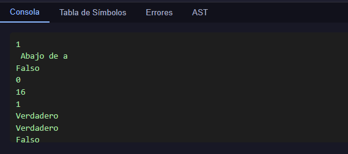

### 6.3 Revisando Errores

La pestaña "Errores" muestra los problemas encontrados durante la ejecución:

- **Errores Léxicos**: Problemas con tokens no reconocidos.
- **Errores Sintácticos**: Problemas con la estructura del código.
- **Errores Semánticos**: Problemas con la lógica del programa.

Cada error incluye:
- Número de error
- Tipo de error
- Descripción detallada
- Línea y columna donde ocurrió

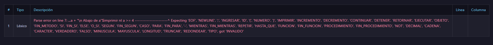

### 6.4 Explorando la Tabla de Símbolos

La pestaña "Tabla de Símbolos" muestra todas las variables declaradas y sus valores:

- **ID**: Nombre de la variable.
- **Tipo**: Tipo de dato de la variable.
- **Valor**: Valor actual de la variable.

Esta tabla es útil para depurar y entender el estado de tu programa.

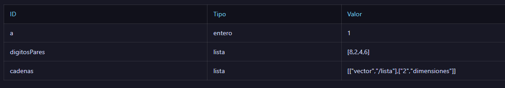

### 6.5 Analizando el AST

El AST (Árbol de Sintaxis Abstracta) es una representación gráfica de la estructura de tu programa:

- Muestra cómo se organizan jerárquicamente las instrucciones.
- Permite visualizar el flujo del programa.
- Ayuda a entender cómo el intérprete analiza el código.

La visualización del AST ofrece:
- Zoom in/out para explorar detalles.
- Posibilidad de descargar como SVG.
- Vista en pantalla completa para análisis detallado.

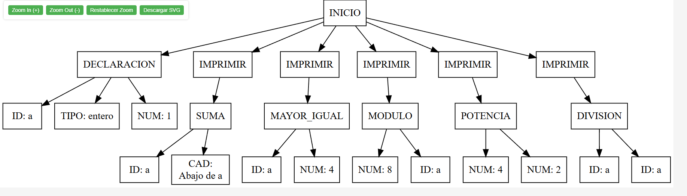

---

## 7. Ejemplos Prácticos

### 7.1 Ejemplo Básico: Calculadora

Este ejemplo implementa una calculadora simple que permite realizar operaciones básicas.

```
// Programa: Calculadora Simple
imprimir nl "==== CALCULADORA SIMPLE ===="
imprimir nl "1. Suma"
imprimir nl "2. Resta"
imprimir nl "3. Multiplicación"
imprimir nl "4. División"

ingresar opcion como entero con valor 1
ingresar num1 como decimal con valor 10
ingresar num2 como decimal con valor 5
ingresar resultado como decimal

segun opcion hacer
    en caso de ser 1 entonces
        resultado -> num1 + num2
        imprimir nl num1 + " + " + num2 + " = " + resultado
    detener
    
    en caso de ser 2 entonces
        resultado -> num1 - num2
        imprimir nl num1 + " - " + num2 + " = " + resultado
    detener
    
    en caso de ser 3 entonces
        resultado -> num1 * num2
        imprimir nl num1 + " * " + num2 + " = " + resultado
    detener
    
    en caso de ser 4 entonces
        si num2 == 0 entonces
            imprimir nl "Error: No se puede dividir entre cero"
        de lo contrario
            resultado -> num1 / num2
            imprimir nl num1 + " / " + num2 + " = " + resultado
        fin si
    detener
    
    de lo contrario entonces
        imprimir nl "Opción no válida"
    detener
fin segun
```

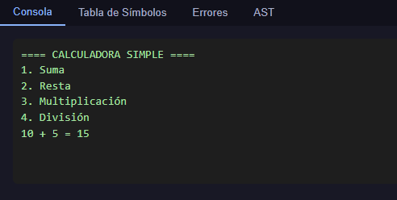

### 7.2 Manejo de Listas

Este ejemplo muestra cómo trabajar con listas y realizar operaciones como encontrar el valor máximo:

```
// Programa: Manejo de Listas
ingresar Lista (5, entero) numeros -> (10, 7, 3, 8, 1)
ingresar suma como entero con valor 0

// Sumar todos los elementos
para i -> 0 hasta 4 con incremento i++ hacer
    suma -> suma + numeros[i]
fin para

imprimir nl "Elementos de la lista: " + numeros[0] + ", " + numeros[1] + ", " + numeros[2] + ", " + numeros[3] + ", " + numeros[4]
imprimir nl "Suma total: " + suma

// Encontrar el máximo
ingresar max como entero con valor numeros[0]

para i -> 1 hasta 4 con incremento i++ hacer
    si numeros[i] > max entonces
        max -> numeros[i]
    fin si
fin para

imprimir nl "El valor máximo es: " + max
```

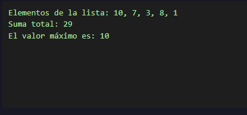

### 7.3 Uso de Objetos

Este ejemplo muestra cómo definir y usar objetos:

```
// Programa: Uso de Objetos
objeto Rectangulo (
    base decimal
    altura decimal
)

Rectangulo -> metodo area
    retornar base * altura
fin metodo

Rectangulo -> metodo perimetro
    retornar 2 * (base + altura)
fin metodo

Rectangulo -> metodo cambiarDimensiones con parametros (nuevaBase decimal, nuevaAltura decimal)
    base -> nuevaBase
    altura -> nuevaAltura
    imprimir nl "Dimensiones actualizadas: " + base + " x " + altura
fin metodo

// Creación de instancias
ingresar objeto Rectangulo rect1 -> Rectangulo (
    5.0,
    3.0
)

imprimir nl "Rectángulo: " + rect1.base + " x " + rect1.altura
imprimir nl "Área: " + ejecutar rect1.area()
imprimir nl "Perímetro: " + ejecutar rect1.perimetro()

// Cambiar dimensiones
ejecutar rect1.cambiarDimensiones(7.5, 4.2)
imprimir nl "Nueva área: " + ejecutar rect1.area()
```

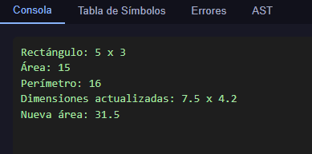


---

## 8. Solución de Problemas

### 8.1 Problemas Comunes

**El programa no se ejecuta**:
- Verifica que no tengas errores sintácticos o léxicos.
- Revisa si tienes las llaves, paréntesis y comillas correctamente balanceados.
- Comprueba que todas las instrucciones estén correctamente terminadas.

**Los valores booleanos aparecen incorrectamente**:
- Asegúrate de usar `verdadero` o `falso` para los valores booleanos.
- Ten en cuenta que son sensibles a mayúsculas/minúsculas.

**Problemas con las listas**:
- Verifica que los índices sean válidos (empiezan en 0).
- Asegúrate de no acceder a posiciones fuera del rango de la lista.

**Las cadenas no muestran caracteres especiales**:
- Usa secuencias de escape como `\n` para nueva línea y `\t` para tabulación.

### 8.2 Mensajes de Error

**Error léxico**:
- "Carácter no reconocido" - Has usado un carácter que no está definido en el lenguaje.

**Error sintáctico**:
- "Esperando X, pero se encontró Y" - La estructura del código no es correcta.

**Error semántico**:
- "Variable X no declarada" - Estás usando una variable antes de declararla.
- "Variable X ya declarada" - Estás intentando declarar una variable con un nombre ya existente.
- "Operación no válida para el tipo X" - Estás intentando realizar una operación incompatible con el tipo de dato.

---

## 9. Recomendaciones y Buenas Prácticas

1. **Organización del código**:
   - Usa comentarios para explicar tu código.
   - Agrupa las instrucciones relacionadas.
   - Usa nombres descriptivos para variables y funciones.

2. **Depuración**:
   - Utiliza `imprimir nl` para mostrar valores intermedios.
   - Revisa la tabla de símbolos para verificar el estado de las variables.
   - Usa el AST para entender cómo se estructura tu programa.

3. **Manejo de errores**:
   - Verifica siempre las condiciones de borde (ej. divisiones por cero).
   - Valida los datos de entrada antes de usarlos.
   - Lee cuidadosamente los mensajes de error para identificar problemas.

4. **Optimización**:
   - Evita repetir código usando funciones y procedimientos.
   - Organiza tus datos en estructuras adecuadas (objetos, listas).
   - Simplifica las expresiones complejas.

---

## 10. Referencias

- Documentación oficial de SimpliCode [placeholder]
- Repositorio del proyecto en GitHub [placeholder]
- Tutoriales y ejemplos adicionales [placeholder]
- Comunidad y soporte [placeholder]

---